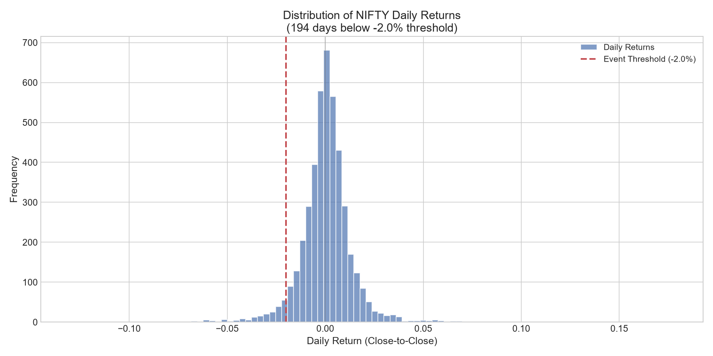
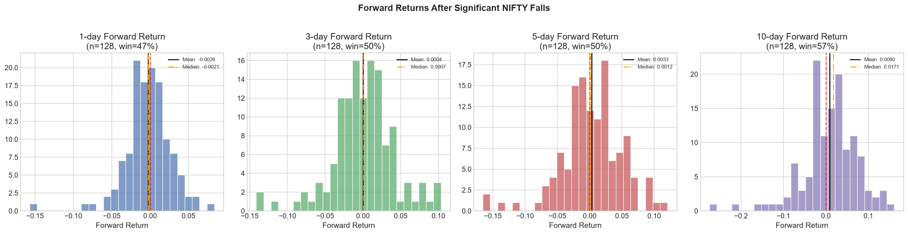
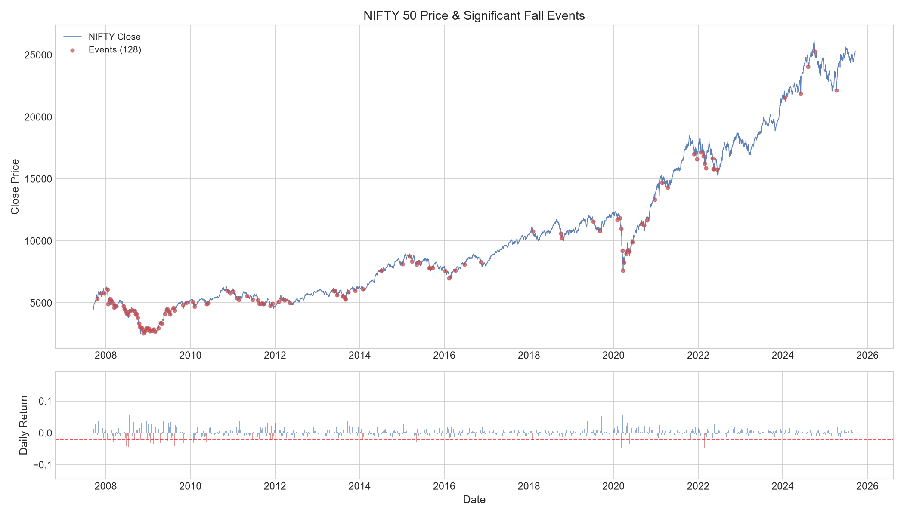
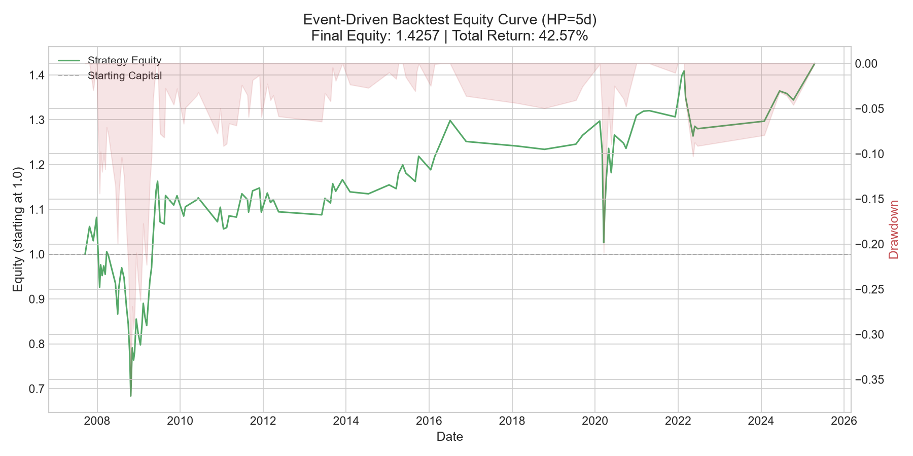
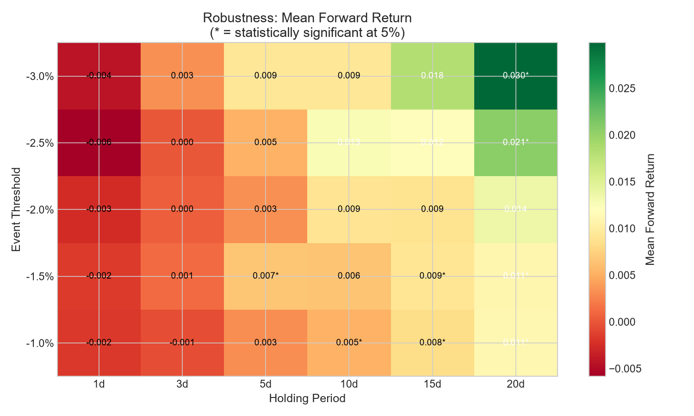
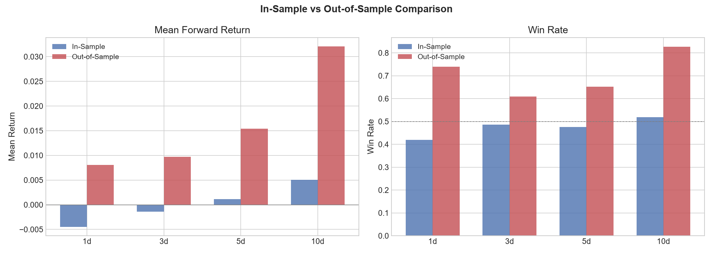
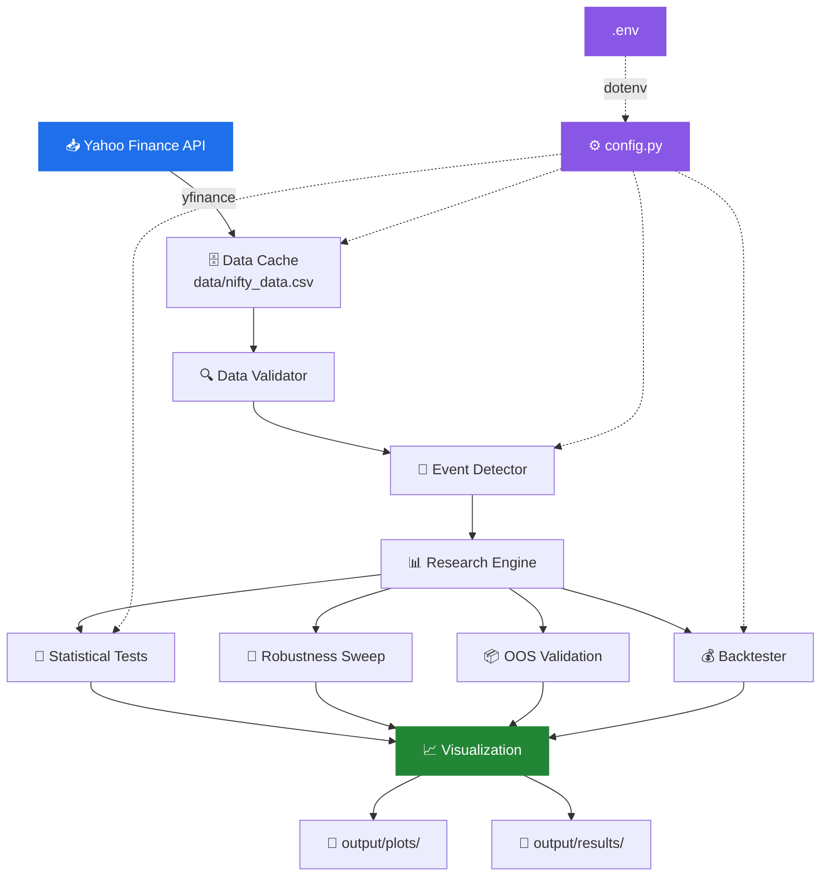

<div align="center">

<!-- Animated Header -->


<br/>

<!-- Badges -->
[](https://python.org)
[](LICENSE)
[]()
[](https://finance.yahoo.com)
[]()

<br/>

<em>A complete quantitative research pipeline investigating whether NIFTY 50 recovers after significant single-day falls — built with rigorous statistical methodology and honest conclusions.</em>

<br/>

[📊 Key Findings](#-key-findings) · [🔬 Methodology](#-methodology) · [🚀 Quick Start](#-quick-start) · [📈 Results Gallery](#-results-gallery) · [🏗️ Architecture](#%EF%B8%8F-architecture)

---

</div>

## 🎯 The Hypothesis

> **"After a significant one-day fall in NIFTY 50, the market tends to recover over the next few trading days."**

This project rigorously tests this popular market belief using **18 years of NIFTY 50 data** (2007–2025), applying institutional-grade statistical methods. The result? A **negative finding** — which is just as valuable as a positive one.

<br/>

## 📊 Key Findings

<div align="center">

| Holding Period | Mean Return | p-value | Significant? | Win Rate | vs Baseline |
|:-:|:-:|:-:|:-:|:-:|:-:|
| 🕐 1 day | -0.26% | 0.836 | ❌ No | 46.9% | -0.26% |
| 🕒 3 days | +0.04% | 0.452 | ❌ No | 50.0% | -0.05% |
| 🕔 5 days | +0.33% | 0.219 | ❌ No | 50.0% | +0.15% |
| 🕙 10 days | +0.90% | 0.061 | ⚠️ Marginal | 57.0% | +0.49% |

</div>

> [!IMPORTANT]
> **Conclusion**: The evidence does **not** statistically support the dip-recovery hypothesis at the 5% significance level. The 10-day period shows a suggestive trend (p=0.061), but parametric tests and bootstrap CIs include zero. A negative result is itself informative — consistent with market efficiency.

<br/>

## 🔬 Methodology

<details>
<summary><b>📐 Precise Definitions (click to expand)</b></summary>

| Term | Definition | Rationale |
|------|-----------|-----------|
| **Significant fall** | Daily return ≤ -2% | Captures ~4.4% worst trading days (~1.5σ below mean) |
| **Entry price** | Next trading day's Open | Avoids look-ahead bias — earliest realistic execution |
| **Exit price** | Close of holding-period day | Standard daily backtest convention |
| **Overlap cooldown** | 5 trading days between events | Ensures statistical independence |

</details>

### 📋 10-Step Research Pipeline

```
┌─────────────────────────────────────────────────────────────────────┐
│                                                                     │
│   📥 Step 1    Data Sourcing         Yahoo Finance (^NSEI)          │
│       ↓                              4,416 trading days             │
│   🔍 Step 2    Data Validation       0 missing, 0 duplicates       │
│       ↓                              3 suspicious observations      │
│   🎯 Step 3    Event Detection       128 events after cooldown      │
│       ↓                                                             │
│   📊 Step 4    Statistical Tests     t-test, Wilcoxon, Bootstrap   │
│       ↓                                                             │
│   🔄 Step 5    Robustness Sweep      5 thresholds × 6 periods      │
│       ↓                              8/30 significant (27%)        │
│   📦 Step 6    Out-of-Sample         70/30 chronological split     │
│       ↓                                                             │
│   💰 Step 7    Backtest              115 trades, 42.57% return     │
│       ↓                                                             │
│   📈 Step 8    Visualization         10 publication-quality charts  │
│       ↓                                                             │
│   ⚖️  Step 9    Self-Challenge        7 bias & limitation checks    │
│       ↓                                                             │
│   🏁 Step 10   Conclusion            Honest negative result        │
│                                                                     │
└─────────────────────────────────────────────────────────────────────┘
```

### 📉 Statistical Methods

| # | Method | Purpose |
|---|--------|---------|
| 1 | **One-sample t-test** | Tests if mean forward return > 0 |
| 2 | **Wilcoxon signed-rank** | Non-parametric median test (no normality assumption) |
| 3 | **95% Confidence Intervals** | Parametric (t-distribution) bounds on mean |
| 4 | **Bootstrap Resampling** | 10,000 iterations for distribution-free CI |
| 5 | **Welch's two-sample t-test** | Event returns vs unconditional baseline |

<br/>

## 📈 Results Gallery

<div align="center">

### Daily Returns Distribution


<br/><br/>

### Forward Returns by Holding Period


<br/><br/>

### Event Timeline on NIFTY Price Chart


<br/><br/>

### Backtest Equity Curve


<br/><br/>

### Robustness Heatmap


<br/><br/>

### In-Sample vs Out-of-Sample


</div>

<br/>

## 🏗️ Architecture



<br/>

## 🚀 Quick Start

### Prerequisites

- **Python 3.10+**
- Internet connection (for initial data download)

### 1️⃣ Clone the Repository

```bash
git clone https://github.com/adarsh-pathak-2006/nifty-dip-recovery-research.git
cd nifty-dip-recovery-research
```

### 2️⃣ Install Dependencies

```bash
pip install -r requirements.txt
```

### 3️⃣ Configure (Optional)

```bash
cp .env.example .env
# Edit .env to customize parameters (threshold, dates, costs, etc.)
```

### 4️⃣ Run the Full Pipeline

```bash
python main.py
```

This executes all 10 steps end-to-end in ~20 seconds:

```
======================================================================
NIFTY DIP-RECOVERY RESEARCH ENGINE
Hypothesis: 'After a significant one-day fall in NIFTY,
the market tends to recover over the next few trading days.'
======================================================================

 ✅ Step 1:  Data sourced (4,416 trading days)
 ✅ Step 2:  Data validated (0 issues found)
 ✅ Step 3:  128 events detected after cooldown filter
 ✅ Step 4:  Statistical tests complete
 ✅ Step 5:  Robustness sweep (30 combinations)
 ✅ Step 6:  Out-of-sample validation done
 ✅ Step 7:  Backtest: 115 trades, 42.57% return
 ✅ Step 8:  10 charts generated
 ✅ Step 9:  Self-challenge documented
 ✅ Step 10: Conclusion: Hypothesis NOT supported
```

<br/>

## 📁 Project Structure

```
nifty-dip-recovery-research/
│
├── 📄 main.py                    # Main orchestrator — runs all 10 steps
├── ⚙️ config.py                   # All parameters (reads from .env)
├── 📋 requirements.txt           # Python dependencies
├── 🔒 .env.example               # Environment variable template
├── 📝 .gitignore                 # Git ignore rules
├── 📜 LICENSE                    # MIT License
│
├── src/                          # Core analysis modules
│   ├── data_loader.py            #   ↳ Yahoo Finance data sourcing
│   ├── data_validator.py         #   ↳ 7-point data quality checks
│   ├── event_detector.py         #   ↳ Event detection & cooldown filter
│   ├── research_engine.py        #   ↳ Aggregate statistics engine
│   ├── statistical_tests.py      #   ↳ 5 hypothesis tests + bootstrap
│   ├── baseline_robustness.py    #   ↳ Baseline comparison & sweep
│   ├── backtest.py               #   ↳ Event-driven trading backtest
│   └── visualization.py          #   ↳ 7 chart types (10 plots)
│
├── data/
│   └── nifty_data.csv            # Cached NIFTY 50 data (auto-generated)
│
├── output/
│   ├── plots/                    # 10 generated visualizations
│   │   ├── 01_daily_returns_distribution.png
│   │   ├── 02_forward_returns_distribution.png
│   │   ├── 03_event_timeline.png
│   │   ├── 04_equity_curve.png
│   │   ├── 05_robustness_heatmap.png
│   │   ├── 06_bootstrap_*.png    # Bootstrap distributions (4 plots)
│   │   └── 07_oos_comparison.png
│   └── results/                  # Detailed CSV & text outputs
│       ├── event_vs_baseline.csv
│       ├── robustness_sweep.csv
│       ├── backtest_trades.csv
│       ├── event_data.csv
│       └── full_research_output.txt
│
├── 📊 RESEARCH_NOTE.md           # 2-page research summary
└── 🤖 AI_USAGE_NOTE.md           # AI tool usage disclosure
```

<br/>

## 💡 Backtest Performance

<div align="center">

| Metric | Value |
|:------:|:-----:|
| **Total Trades** | 115 |
| **Total Return** | 42.57% |
| **CAGR** | 2.05% |
| **Win Rate** | 53.0% |
| **Profit Factor** | 1.27 |
| **Max Drawdown** | -36.83% |
| **Best Trade** | +15.71% |
| **Worst Trade** | -16.72% |

</div>

> [!NOTE]
> The backtest includes 0.20% round-trip transaction costs. While the total return is positive, the 2.05% CAGR significantly underperforms buy-and-hold NIFTY over the same period.

<br/>

## ⚠️ Assumptions & Limitations

<details>
<summary><b>Click to expand full list</b></summary>

1. **Transaction costs**: 0.20% round-trip (0.05% brokerage + 0.05% slippage per leg)
2. **No position sizing**: Full capital deployed per trade
3. **Yahoo Finance data**: Not exchange-official; minor discrepancies possible vs NSE
4. **Multiple testing**: Without Bonferroni correction, some results may be spurious
5. **Market regime dependence**: Results may be driven by crisis periods (2008 GFC, 2020 COVID)
6. **Overlap handling**: 5-day cooldown may not fully eliminate correlation during sustained crashes
7. **Index not directly tradable**: Execution would require futures/ETFs, introducing tracking error

</details>

<br/>

## ⚙️ Configuration

All parameters can be configured via the `.env` file:

| Variable | Default | Description |
|----------|---------|-------------|
| `NIFTY_TICKER` | `^NSEI` | Yahoo Finance ticker symbol |
| `DATA_START_DATE` | `2005-01-01` | Historical data start date |
| `DATA_END_DATE` | `2025-09-18` | Historical data end date |
| `EVENT_THRESHOLD` | `-0.02` | Daily return threshold for events |
| `OVERLAP_COOLDOWN_DAYS` | `5` | Min gap between events |
| `TRANSACTION_COST_PCT` | `0.0005` | Cost per leg (0.05%) |
| `SLIPPAGE_PCT` | `0.0005` | Slippage per leg (0.05%) |
| `IN_SAMPLE_RATIO` | `0.70` | Train/test split ratio |
| `BOOTSTRAP_ITERATIONS` | `10000` | Bootstrap resampling iterations |

<br/>

## 📚 Research Documents

| Document | Description |
|----------|-------------|
| [**RESEARCH_NOTE.md**](RESEARCH_NOTE.md) | Concise 2-page research summary with methodology, results, and conclusions |
| [**AI_USAGE_NOTE.md**](AI_USAGE_NOTE.md) | Full disclosure of AI tools used, own decisions made, and lessons learned |

<br/>

## 🙏 Acknowledgments

- **[AlgoChowk](https://algochowk.com/)** — For the challenging and well-designed assignment
- **[Yahoo Finance](https://finance.yahoo.com/)** — Data source via `yfinance` library
- **[SciPy](https://scipy.org/)** & **[statsmodels](https://www.statsmodels.org/)** — Statistical testing frameworks

<br/>

<div align="center">

---

<sub>Built with 📊 by <a href="https://github.com/adarsh-pathak-2006">Adarsh Pathak</a> | AlgoChowk Quant Engineer Intern Assignment</sub>

<br/>


</div>
